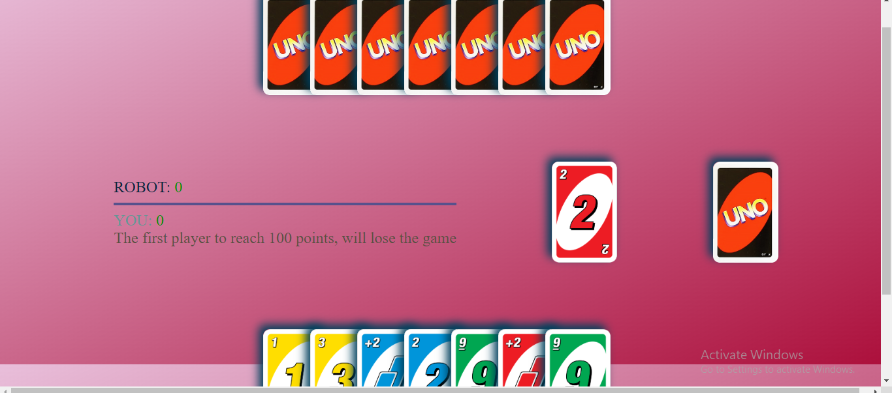

# Uno Game Clone

## Overview

This project is a simple Uno game clone implemented using HTML, CSS, and JavaScript. Uno is a classic card game known for its simplicity and excitement, and this web-based clone aims to bring that experience to your browser.

## Features

- Player vs AI: Challenge a computer-controlled opponent in Uno.
- **User-Friendly Interface:** Enjoy a clean and intuitive interface for a seamless gaming experience.


## Getting Started

## Interface




endly interface makes playing Uno a breeze.*

### Installation

1. Clone the repository to your local machine:

   ```bash
   git clone https://github.com/Shwetakumari9555/Uno-Game.git
   ```

2. Open the `index.html` file in your preferred web browser.

### Usage

1. Open the `index.html` file in your web browser.
2. Follow the on-screen instructions to set up the game and start playing.

## Customization

You can customize the game by modifying the `styles.css` and `script.js` files. Adjust the styles and game logic to suit your preferences.

## Contribution

Contributions are welcome! If you find any bugs or have suggestions for improvements, please open an issue or submit a pull request.

## License

This Uno Game Clone is licensed under the MIT License - see the [LICENSE](LICENSE) file for details.

## Acknowledgments

- Special thanks to the creators of Uno for the inspiration.
- Thanks to the open-source community for providing valuable resources and inspiration.

Have fun playing Uno!
